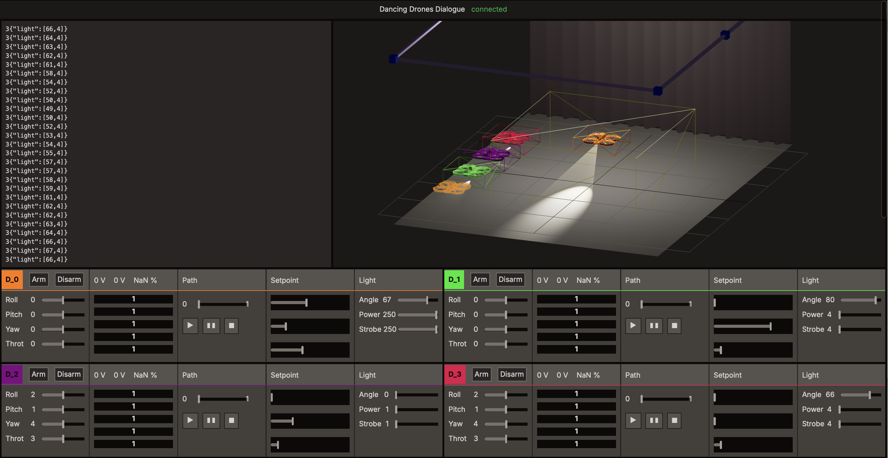
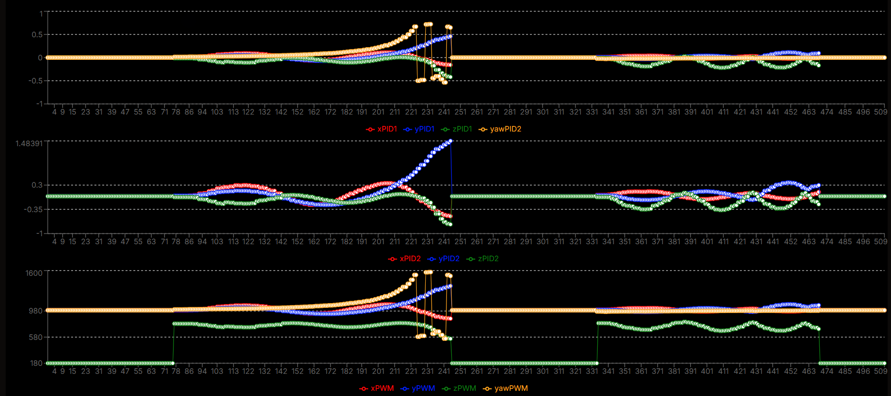
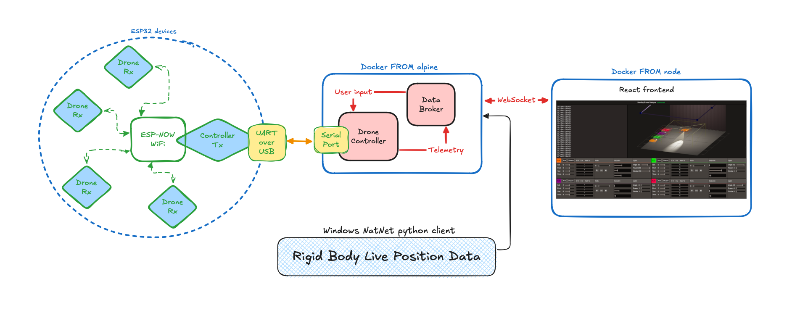

# Drone Dance Dialog



An **open source application** designed for **motion capture, choreographing and visualizing drones** accurately in space using the **OptiTrack system**.  
This project leverages precise real-time motion capture to control and preview drones, both in simulation and live flight.  
User control interface is built with **React**, while the backend is written in **C++** and communicates with drones using **ESP32** modules connected over ESP-NOW WiFi, ensuring secure and seamless information flow between the control system and the drones.  
To ensure consistent runtime environment, main project modules run inside individual docker containers.  

---

## Features

- **Choreograph and visualize drone movements** in a 3D space via an intuitive web interface.
- **Blender animation export integration** to control and execute pre-programmed drone flight patterns.
- **Live control and preview** of drone positions and movements in real-time.
- Communication between **C++ backend** and drones using **ESP32** devices.
- Utilizes the **OptiTrack motion capture system** for precise drone tracking.
- A **tool to monitor and fine-tune 3D data**, enabling adjustments to PID controllers and debugging directly within the system.

  
*An example of the 3D data tuning tool for PID and debugging.*

---

## System Architecture

Below is a graphical representation of the system architecture, illustrating how the project is split into different components and how data flows between them:

  
*The system is divided into modules, showcasing communication between the React frontend, C++ backend, and ESP32 drones.*

---

## Demo


  

---

## Requirements

- Docker with Docker Compose
- Forward USB to UART serial port to WSL (if running on MS Windows):
  ```bash
  usbipd list
  usbipd bind --busid <device BUSID>
  usbipd attach --wsl --busid <device BUSID>

## Tech Stack

### Backend
- **C++**: Core logic and communication handling.
- **ESP32**: Wireless communication between backend and drones (sending and receiving commands/data).
- **Python Natnet Server**: Serve the OptiTrack 3d data to the backend.
  
### Frontend
- **React.js**: Web app for visualizing and controlling the drones.
- **Three.js**: 3D visualization for live drone choreography preview.

### Additional Components
- **Blender**: Integration for exporting drone choreography as animations.
- **OptiTrack**: Motion capture system to track drone positions in real-time.
