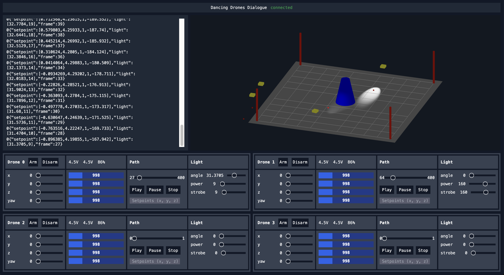

# Dancing Drones Dialogue with OptiTrack

A **React web application** designed for **choreographing and visualizing drones** accurately in space using the **OptiTrack system**. This project leverages real-time motion capture to control and preview drones, both in simulation and live flight. The backend is written in **C++** and communicates with drones using **ESP32** modules, ensuring seamless information flow between the system and the drones.

## Features

- **Choreograph and visualize drone movements** in a 3D space using a web interface.
- **Blender animation export integration** to control and execute pre-programmed drone movements.
- **Live control and preview** of drone positions and movements in real time.
- Communication between **C++ backend** and drones via **ESP32** devices.
- Utilizes the **OptiTrack motion capture system** for accurate drone tracking.

## Requirements

- Docker with Docker Compose
- Forward USB to UART serial port to WSL (if running on MS Windows)
> `usbipd list`
> `usbipd bind --busid <device BUSID>`
> `usbipd attach --wsl --busid <device BUSID>`

## Tech Stack

### Backend
- **C++**: Core logic and communication handling.
- **ESP32**: Wireless communication between backend and drones (sending and receiving commands/data).
  
### Frontend
- **React.js**: Web app for visualizing and controlling the drones.
- **Three.js**: 3D visualization for live drone choreography preview.

### Additional Components
- **Blender**: Integration for exporting drone choreography as animations.
- **OptiTrack**: Motion capture system to track drone positions in real-time.
